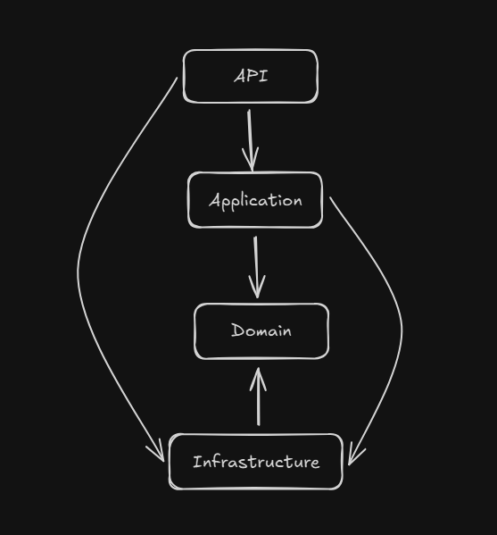

# C# .NET8 con Docker

## Requerimientos

- C# .NET 8

Clona este repositorio:

```bash
git clone 
```

El repositorio contiene una solución con 4 apps siguiendo una arquitectura Hexagonal.

```
docker-sharp
|── webSchool.Api/ 
  └── Dockerfile
|── webSchool.Application/
|── webSchool.Domain/
|── webSchool.Infrastructure/
|── .dockerignore
|── compose.yaml
```

**Referencias:**

